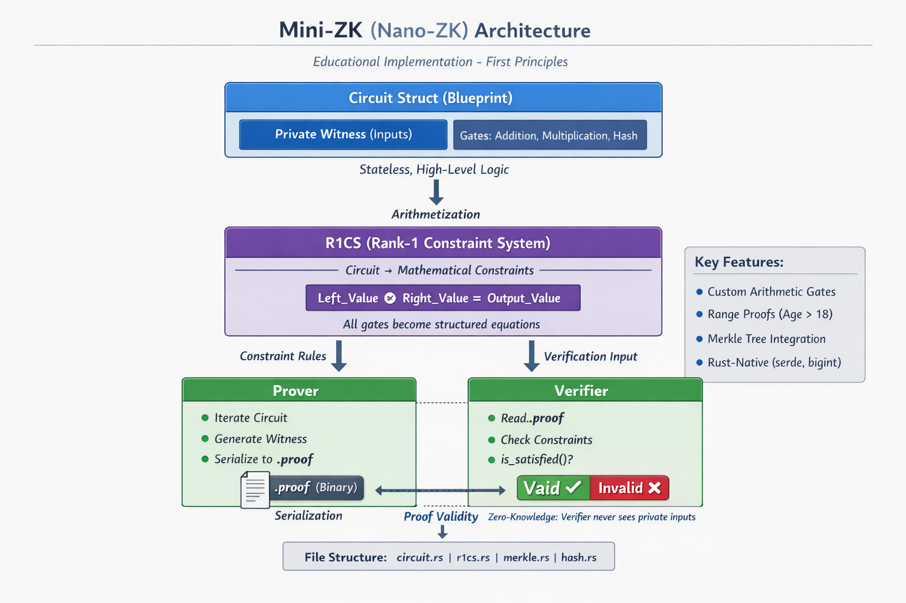

# 🦀 Mini-ZK: A Bare-Bones ZK Proof System in Rust

**Nano-ZK** is a Zero-Knowledge (ZK) framework built from scratch in Rust. Unlike production-grade libraries (Noir, Circom) that treat the Prover/Verifier relationship as a "black box," Nano-ZK exposes the underlying plumbing of **R1CS (Rank-1 Constraint Systems)** and **Circuit Arithmetization**.


---

## 🏗 Architecture Overview



The system is split into three distinct layers, mimicking the workflow of modern ZK-SNARKs:

### 1. The Circuit (High-Level Logic)
The `Circuit` struct is the "blueprint." It defines the inputs (Private Witness) and the gates (Addition, Multiplication, Hashing) that represent the business logic. It is **stateless**; once defined, the wires do not change.

### 2. R1CS (Rank-1 Constraint System)
The "Translator." It flattens the circuit into a series of mathematical constraints. Every gate is converted into a structured equation:
$$Left\_Value \circ Right\_Value = Output\_Value$$
The R1CS ensures that for any given set of inputs, the mathematical "pressure" balances across all constraints.

### 3. The Prover & Verifier
* **Prover:** Iterates through the circuit, generates the **Witness** (the values on every wire), and serializes them into a `.proof` binary.
* **Verifier:** Reads the `.proof` and the public constraints, then executes an `is_satisfied` check to confirm the logic holds without knowing the private inputs.

---

## 🚀 Key Features

* **Custom Arithmetic Gates:** Support for Addition and Multiplication.
* **Primitive Range Proofs:** Foundational logic for inequality checks (e.g., Age > 18).
* **Merkle Tree Integration:** Proof of membership for blockchain-style transaction verification.
* **Rust-Native Performance:** Uses `serde` for efficient proof serialization and `bigint` for arbitrary-precision arithmetic.

---

## 🛠 Project Structure

```text
.
├── src/
│   ├── main.rs          # Entry point: Example proof implementations
│   ├── circuit.rs       # The Circuit blueprint and Proof Generator
│   ├── r1cs.rs          # Constraint system logic and 'is_satisfied' checker
│   ├── merkle.rs        # Utility: Merkle Tree & Path generation
│   └── hash.rs          # Utility: Mock hash functions for debugging
└── Cargo.toml           # Dependencies (rand, sha2, serde, bincode)
```

---

## 🙏Acknowledgement
This project was inspired by the original **Mini-ZK** implementation by **Luis Soares**  
(https://github.com/luishsr/zk-mini).

His work provided the conceptual foundation for the circuit-to-R1CS pipeline and the
first-principles approach to Zero-Knowledge system design that this repository builds on.

This Rust implementation is an independent, from-scratch re-engineering focused on
clarity, extensibility, and systems-level understanding of ZK proof mechanics.

## 🧾License
This project is licensed under the MIT License. See [LICENSE](./LICENSE) for details.

